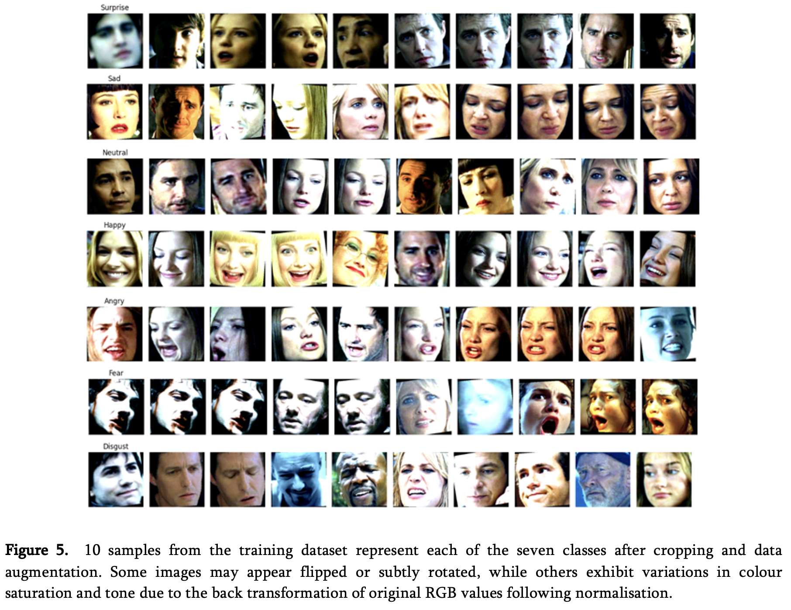

# Facial Emotion Recognition in the Wild (SFEW)

[Open the notebook →](emotion_recognition.ipynb){ .md-button }
[Download the report (PDF) →](assets/FER_Report.pdf){ .md-button target="_blank" }

## Summary
I compared **feature-engineered classifiers** (SVM) with **deep learning** approaches (custom CNN and **VGG-16 fine-tuning**) for Facial Emotion Recognition (FER) on **Static Facial Expressions in the Wild (SFEW) dataset**. Classic models set a baseline, a small CNN improved results, and fine-tuning with VGG-16 achieved the best performance (**44.12%** test accuracy). Results reflect the difficulty of FER under real-world conditions (pose, lighting, occlusion) and the limits of hand-crafted features.

## Data
- **SFEW**: 674 images from 38 films; 7 classes (angry, disgust, fear, happy, neutral, sad, surprise).  
- **Preprocessing**: face detection/cropping (MTCNN + manual fixes), standardisation; on-the-fly augmentation (flips, rotation); colour inputs performed better than greyscale.

## Methods
- **SVM (RBF)** baseline with grid search (5-fold CV).  
- **CNN**: 3-block conv net with batch norm, max-pooling; tuned LR/weight decay/batch size; early stopping.  
- **Transfer learning**: **VGG-16** pretrained on ImageNet; classifier replaced for 7 classes; staged unfreezing and fine-tuning.

## Results
- **SVM (5-fold CV): ~23.9%** accuracy.  
- **Custom CNN**: ~**38–40%** on held-out test (single-run variability).  
- **VGG-16 fine-tuned**: **44.12%** test accuracy (best).  
- Class difficulty uneven; **disgust/neutral/surprise** remained hardest; **happy** was most reliably detected.

## Takeaways
- Transfer learning materially outperforms hand-crafted features and shallow models on SFEW.  
- Small data + unconstrained conditions limit absolute accuracy; careful augmentation and regularisation help but do not close the gap.

## Next steps
- Stronger backbones (e.g. ResNet/ViT), improved augmentation (cutout/mixup), repeated stratified CV for stability.  
- Error analysis by pose/occlusion; consider facial landmarks or multi-modal signals (audio/physiology).

## Visuals

-->

**Full repo:** https://github.com/ClaireLouiseR/COMP8420
